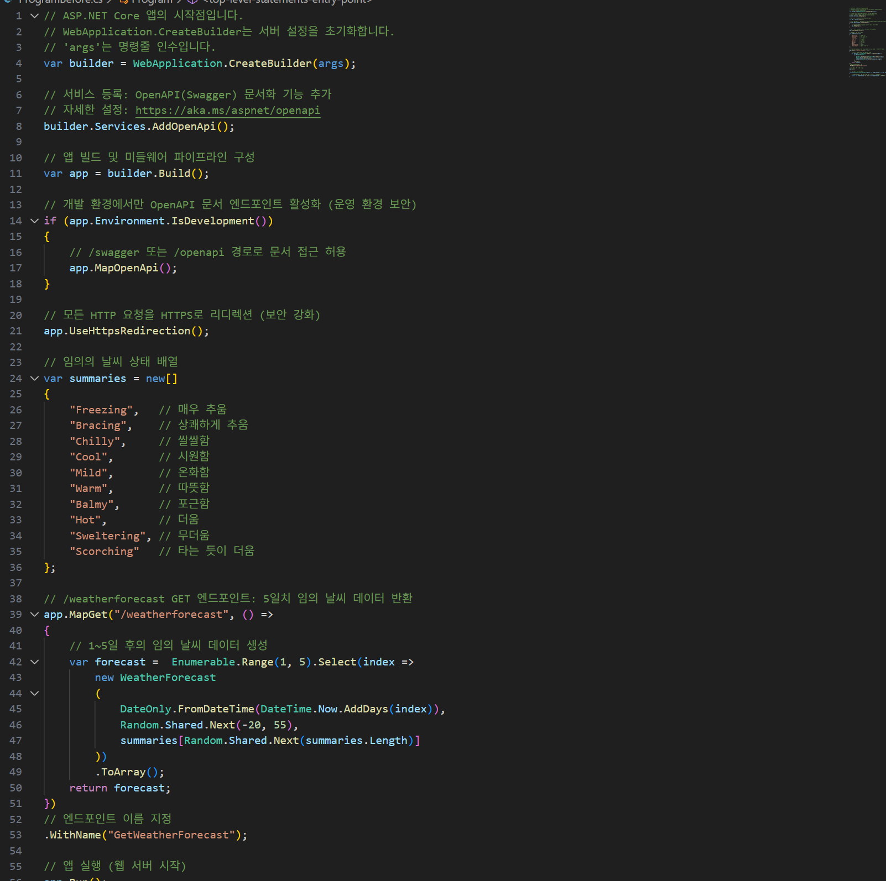
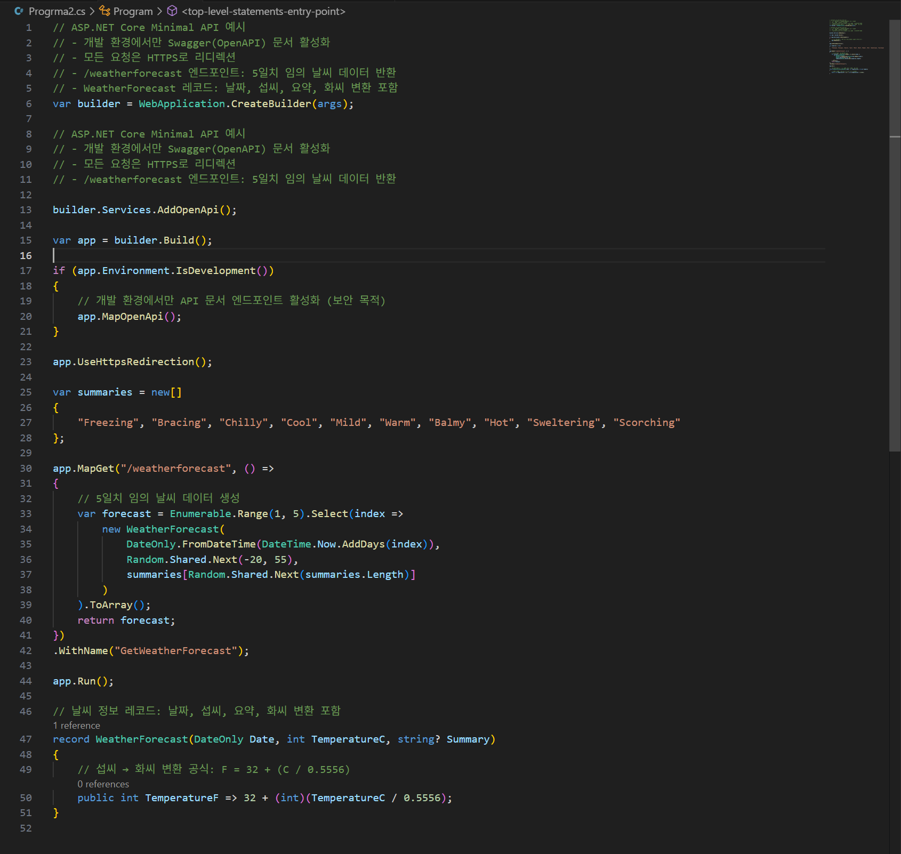
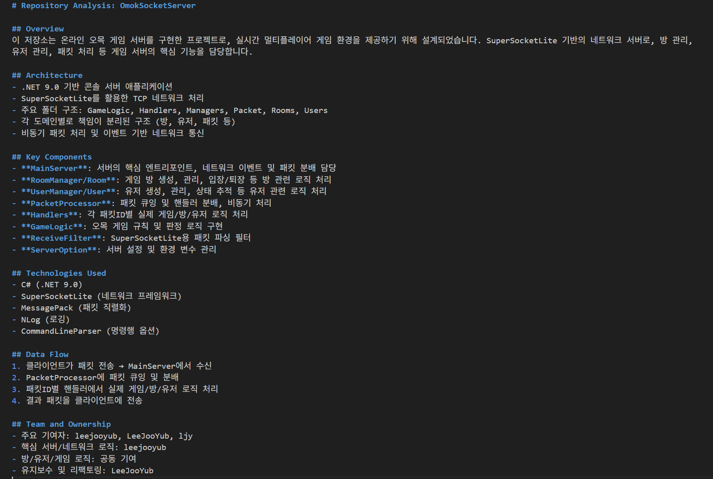
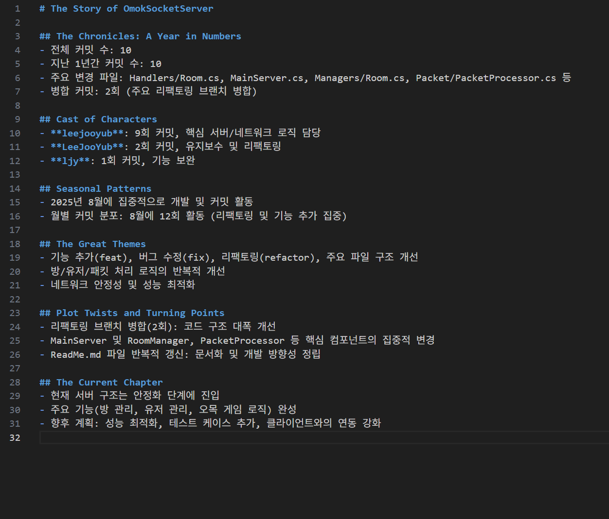
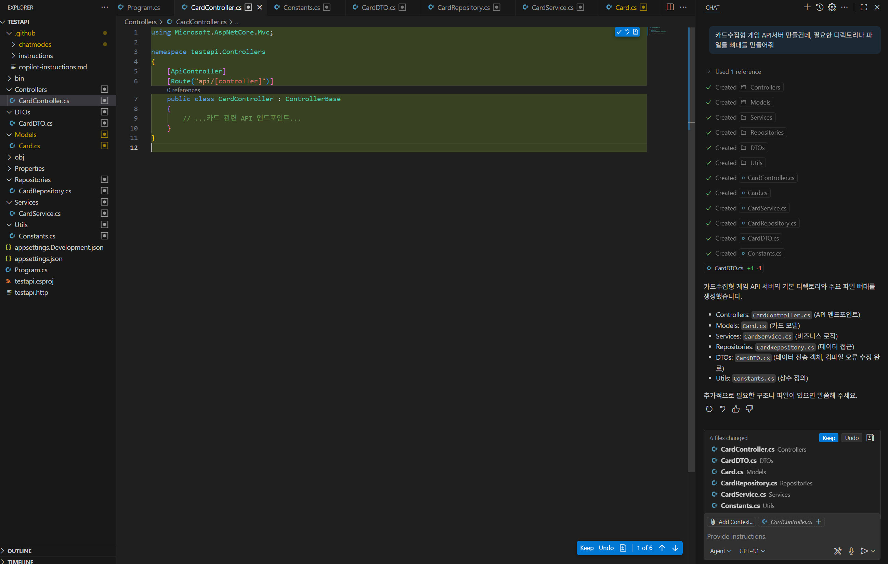
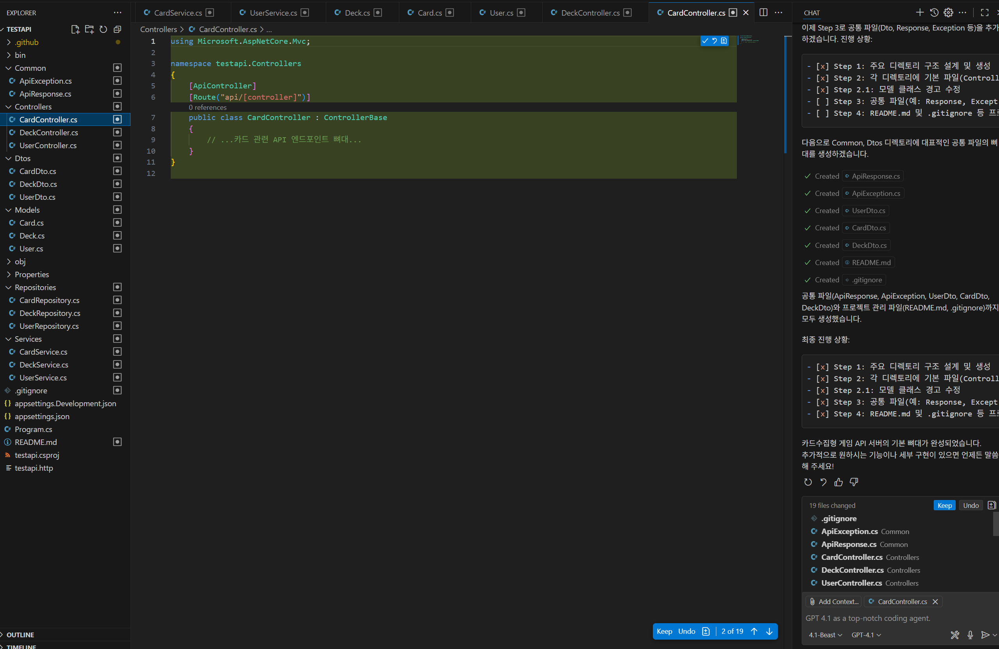
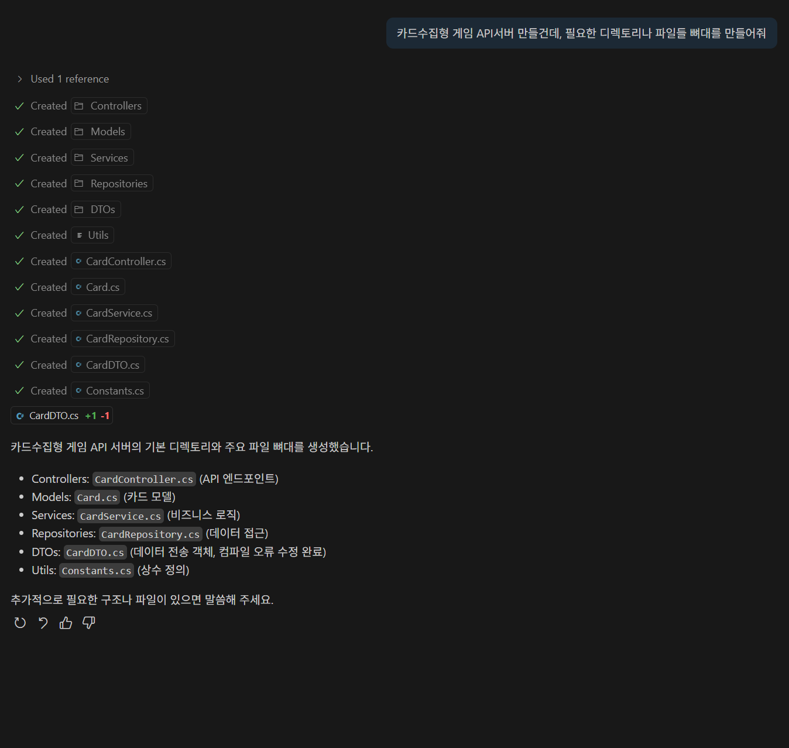
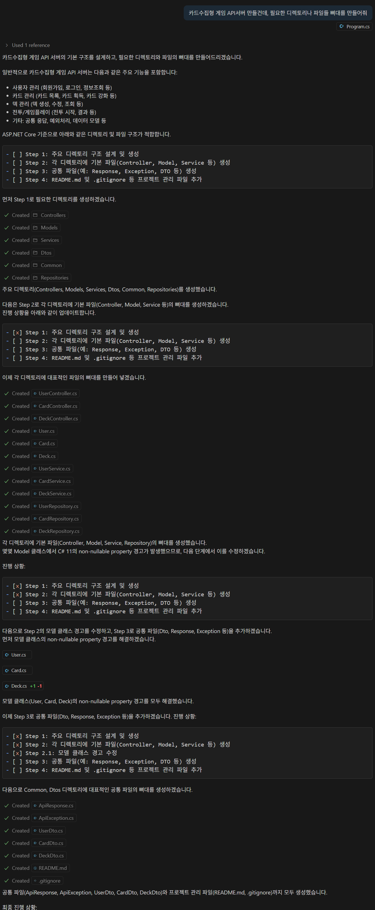

# 🌟Awesome GitHub Copilot 활용 가이드

이 문서는 **VS Code** 환경에서 **Awesome-Copilot**을 이용하여 **Gihub Copilot**를 효과적으로 사용하는 방법을 중점적으로 다룹니다.


###  **본 문서를 유효하게 활용할 수 있는 직군:**
- 게임 개발자 (Unity/Unreal)
- 백엔드 개발자 (Spring, .NET, Java)
- 프론트엔드 개발자 (React, Angular, Vue)
- 데브옵스/클라우드 엔지니어
- 데이터 엔지니어/사이언티스트
- 보안 전문가
- QA 및 테스트 자동화 전문가
- 제품 매니저/기술 문서 작성자
- 아키텍트/시니어 개발자
- 특히, **VS Code에서 Github Copilot을 활용하는 모든 엔지니어 직군**

---

## 📜 목차

1. [Awesome Copilot 소개](#awesome-copilot-소개)
2. [필수 환경 구성](#필수-환경-구성)
3. [결론 미리보기](#결론-미리보기)
4. [Awesome-Copilot 템플릿 카테고리](#awesome-copilot-템플릿-카테고리)
5. [활용 사례](#활용-사례)
6. [추가 템플릿](#추가-템플릿)
7. [종합 결론](#종합-결론)
8. [맞춤형 템플릿 제작](#맞춤형-템플릿-제작)

---

## 📖 서론

GitHub Copilot은 코딩 생산성을 크게 향상시켜주는 강력한 도구지만, 많은 개발자들이 비슷한 한계점을 경험합니다.  
여러분도 이런 생각을 해본 적이 있을 것입니다:

- "Copilot에 **특정한 페르소나** (예시 : 코드 리뷰어)를 부여하여, 해당 역할에 맞게 대답을 조정하고 싶다."
- "우리 팀만의 **코딩 스타일과 패턴**에 맞게 응답을 조정하고 싶다."
- "매번 **같은 지시사항**을 반복해서 입력하는 것이 비효율적이다."
- "**특정 작업**에 더 특화된 도움을 받고 싶다."

이런 문제를 해결하기 위해 VS Code의 Copilot의 **사용자 지정 기능**(Custom Instructions, Chat Modes, Prompts)을 활용할 수 있습니다.  
(자세한 설명은 공식 [문서](https://code.visualstudio.com/docs/copilot/copilot-customization?originUrl=%2Fdocs%2Fcopilot%2Fcopilot-customization)에서 확인할 수 있습니다.)
해당 기능은 사용자가 일종의 **템플릿**을 작성하여, 사용자가 원하는 방향으로 Copilot의 대답을 유도하는 기능입니다.  
그러나, 이런 템플릿을 매 프로젝트 마다, 직접 작성하거나 적용하는 것은 **또 다른 번거로운 작업**이 될 수 있습니다.  


## 📄 Awesome Copilot 소개

 [**Awesome Copilot**](https://github.com/github/awesome-copilot)은 이런 **번거로움**을 해결하고 **양질의 템플릿**을 구하기 위한 커뮤니티 기반 템플릿 모음집입니다.  
다양한 개발자들이 만든 검증된 템플릿을 자유롭게 활용하고, 필요에 따라 수정하거나, 본인이 만든 유용한 템플릿을 기여할 수 있습니다.   
이를 통해 템플릿을 처음부터 작성하는 수고 없이도 Copilot을 더 똑똑하고 효율적으로 활용할 수 있게 됩니다.

  
정리하자면, **Copilot의 성향 및 대답,행동** 개인/팀에서 **원하는 스타일로 조정**하기 위한, **설정 값 저장소**입니다.

**주요 특징:**
- 오픈소스 저장소로 누구나 기여 가능
- **VS Code**에 특화된 커스터마이징 자료 제공
- 다양한 상황에 맞는 Chat Mode, Prompt, Instruction 템플릿 제공
- 복사-붙여넣기만으로 바로 활용 가능한 '레시피 모음집'


<div align="center">
  
  <p><em>마치 게임에 모드를 설치 하듯이, Copilot에 다양한 커스터마이징 템플릿을 적용할 수 있습니다.</em></p>
</div>


## 📋 Awesome-Copilot 템플릿 카테고리

Awesome-Copilot은 세 가지 핵심 템플릿 카테고리를 제공합니다.   
각 템플릿은 복사해서 그대로 사용하셔도 되고, 팀에 맞게 적절하게 수정해서 사용해도 됩니다.  
필요하다면, 직접 템플릿을 만들어 사용한 후, 해당 저장소에 기여를 할 수도 있습니다.

| 구분 | 파일 형식 | 주요 역할 | 적용 범위 | 적용 시점 |
|------|----------|---------|----------|----------|
| **Instruction** | `.github/copilot-instructions.md` 또는 `.instructions.md` | 공통 규칙 정의 (코드 스타일, 리뷰 방식 등) | 저장소 또는 특정 파일 유형(`.md`, `.cs`, `.py`, `.sql` 등) | 자동 적용 (워크스페이스 로드 시) |
| **Prompt** | `*.prompt.md` | 재사용 가능한 독립형 프롬프트 | 특정 작업에 필요한 부분 | 명시적 호출 시 (`/prompt-이름` 또는 명령 팔레트) |
| **Chat Mode** | `*.chatmode.md` | AI의 페르소나 설정 (예: 디버그 모드, 논리 모드, 리팩토링 모드 등), 동작 원리 지정 | 대화 세션 전체 | 모드 전환 후의 채팅 세션   (채팅 입력란 좌측 드롭다운) |

---

## 템플릿 유형별 메타데이터 속성 및 예시

**※메타 데이터를 설정하면, 해당 템플릿이 작동하는 방식을 설정할 수 있습니다.**   

| 템플릿 유형 | 메타데이터 속성 | 설명 | 예시 |
|-----------|--------------|------|-----|
| **Instructions** | description | 지침 파일에 대한 간략한 설명 | "TypeScript 코딩 규칙 지침" |
|  | applyTo | **자동**으로 해당 지침을 적용할 파일 패턴(글로브 패턴) | "**/*.ts" 또는 "src/**/*.{js,ts,tsx}" |  
| **Chat Mode** | description | 채팅 모드에 대한 간략한 설명 | "코드 리팩토링 전문가 모드" |
|  | model | 사용할 AI 모델 | "GPT-4" 또는 "Claude Sonnet 4" |
| **Prompt** | mode | 프롬프트 실행 채팅 모드 | "agent", "ask", "edit" 혹은 **사용자 지정 모드 (예시: 코드 리팩토링 전문가 모드)** |
|  | model | 사용할 AI 모델 | GPT-4.1 , Claude Sonnet 3.7 등, 사용자가 사용할 수 있는 LLM 모델 |
|  | description | 프롬프트에 대한 간략한 설명 | "아키텍처 설계 문서 생성기" |
---


이 저장소를 활용하면 프로젝트의 특성, 팀의 코딩 스타일, 개인 취향에 맞게 Copilot의 답변을 조정하는 설정 값을 쉽게 가져올 수 있습니다.

## ⚙️ 필수 환경 구성

Awesome Copilot 템플릿을 활용하기 위해서는 다음 환경이 필요합니다:

1. **Visual Studio Code**
   - 최신 버전 권장
   - [다운로드 링크](https://code.visualstudio.com/download)

2. **GitHub Copilot 확장 프로그램**
   - VS Code 마켓플레이스에서 설치
   - 유효한 GitHub Copilot 구독 필요
   - [확장 프로그램 링크](https://marketplace.visualstudio.com/items?itemName=GitHub.copilot)

3. **GitHub Copilot Chat 확장 프로그램**
   - VS Code 마켓플레이스에서 설치
   - 커스텀 지침, 프롬프트, 채팅 모드 기능 사용을 위해 필수
   - [확장 프로그램 링크](https://marketplace.visualstudio.com/items?itemName=GitHub.copilot-chat)

4. **설치 확인**
   - VS Code 좌측 사이드바에 GitHub Copilot 아이콘 확인
   - 우측 상단 상태 표시줄에 Copilot 로고 표시 확인

설치 후 VS Code에서 GitHub 계정으로 로그인하여 Copilot 서비스에 연결해야 합니다.

---


## ⚠️ 주의점 

1. 해당 레포지토리의 템플릿들은 영어로 되어있습니다.  
.github/copilot-instructions.md (공통 지침 파일)에 코드 작성 시를 제외하고, 프롬프트 답변과 주석은 한국어로 답변으로 대답하라는 지침을 명시해두면 좋습니다.

2. Instructions (지침)은 여러개 Import하여 파일 별로 다른 지침을 적용할 수 있습니다.  
그럴 경우에, Chat-Mode를 기본 Agent모드로 진행하면, 특수 파일별 적용 지침들이 무시되는 오류가 있습니다. Ask,Edit등의 다른 기본 Chat-mode를 
사용하거나, Custom Chat-Mode를 사용해야합니다.

3. 모든 템플릿을 사용하거나 적용해본 것은 아니나, 제가 사용해보고 추천할만한 템플릿은 다음과 같습니다.

4. Instruction, Chat_mode 같은 경우에는 과도하게 설치할 경우, 오히려 프롬프팅 결과가 안 좋아지는 결과를 초례합니다.

<div align="center">
  
  <p><em>게임 모드를 너무 설치하면 모드끼리 충돌이 날 수 있듯, Awesome-Copilot 템플릿 역시 필요한 만큼만 사용해야합니다.</em></p>
</div>


- 


## 📊 사용 결론 미리보기


※ 템플릿 종류가 많고, Copilot Model도 워낙 다양해서 모든 경우의 수를 테스트해보진 못했습니다. 

- Instruction 카테고리의 템플릿은, 유용하긴 했지만, 각 팀마다 커스터마이징을 하는 것이 더 좋다는 생각이 들었습니다.
각 프로젝트마다, 컨벤션, 코딩스타일이 다르기 때문입니다.

- Prompt 카테고리의 템플릿은, 유용하다고 생각합니다. 
프롬프트를 많이 설치한다고, 템플릿끼리 충돌이 일어나지 않기 때문에 안전하고,
내부에 Tool-Calling이 탑재된 프롬프트 역시 있어서, 복잡한 작업을 빠르게 끝낼 수 있습니다.

- Chat-mode 카테고리의 템플릿은, 매우 유용합니다.
특히 GPT-4.1을 Copilot을 사용한다면, 답변이 너무 짧고, iteration을 하지 않아서, Agent 모드로 사용해도 답답함을 느낍니다.
그러나 Custom된, 해당 template의 gpt4.1-beast-mode를 사용한다면, 그런 불편점이 상당 부분 해소되었습니다.
또한, 다른 카테고리 (Prompt,Instruction)과의 궁합이 매우 좋았습니다.


- 한계점은,
1. 해당 저장소가 영어이므로, 템플릿의 가독성이 조금 떨어집니다.
2. 팀마다 코딩 스타일, 협력 스타일에 따라, 템플릿을 직접 작성하는 것이 더 좋을 수도 있습니다.


**결론** 
1. 해당 저장소의 템플릿들을 이용하면, Copilot의 성능을 더 높일 수 있다.
2. 영어라 접근성이 조금 떨어지고, 팀 단위 작업시, 템플릿을 직접 작성하는 것이 효율이 더 좋을 수도 있다.
3. Chat-Mode 카테고리의 템플릿은 매우 유용하다.

## 🔧 템플릿 설치 방법

1. **해당 저장소에 접속하여, 템플릿을 읽어보고 원하는 템플릿을 골라 Install 한다. [Awesome-Copilot 템플릿 목록]()**
<div style="display: flex; justify-content: center; gap: 20px; margin-bottom: 20px;">
  <div style="text-align: center;">
    
    <p><em>순서1 : 원하는 템플릿을 선택한다.</em></p>
  </div>
  <div style="text-align: center;">
    
    <p><em>순서2 : VS Code에서 확인 버튼을 누른다. </em></p>
  </div>
</div>

2. **추가한 템플릿 목록을 확인한다.**
<div align="center">
  
  <p><em>그림 : 원하는 instructions, chatmode, prompt를 추가한 화면</em></p>
</div>

---

## 📋 템플릿 사용 방법 

### Instruction (지침) 사용 방법

- Instuction은 기본적으로 Copilot Chat을 사용시 자동 적용 된다.
- Instruction의 메타데이터 부분에서 applyTo부분을 조정하면, 자동 적용되는 범위를 제한할 수 있다. 
- 메타 데이터를 다음과 같이 설정하면, 모든 파일에 자동 적용된다.

```yaml
---
applyTo: "**"
---
```

- 이렇게 조정하면, 해당 지침은 cs파일을 수정하고 있을 때만, 적용된다.
```yaml
---
applyTo: "**/*.md"
---
```

#### 예시 ) 목표 : .NET Game API Server 주석 깔끔하게 정리 
- **사용 Instruction : 'ASP.NET REST API(API 설계 부터 배포까지 알려주는 가이드) , C-Sharp(C# 개발 메뉴얼) , Self-Explanatory(불필요한 주석 제거)'**


<div align="center">
  
  <p><em></em></p>
</div>

- 3개의 .cs관련 Instruction을 설치하고, copilot chat에 프롬프트를 입력하면, .cs 수정 시, instruction이 자동 적용된다.

#### 결과

<div style="display: flex; justify-content: center; gap: 20px; margin-bottom: 20px;">
  <div style="text-align: center;">
    
    <p><em>지침 적용 전</em></p>
  </div>
  <div style="text-align: center;">
    
    <p><em>지침 적용 후</em></p>
  </div>
</div>

- 조금 더 깔끔하게 주석이 정리되었다.


#### ⚠️주의점
- Instructions (지침)을 여러개 Import하여 파일 별로 다른 지침을 적용할 수 있습니다.  
그럴 경우에, Chat-Mode를 기본 Agent모드로 진행하면, 특수 파일별 적용 지침들이 무시되는 오류가 있습니다. Ask,Edit등의 다른 기본 Chat-mode를 
사용하거나, Custom Chat-Mode를 사용해야합니다.


---

### 💬Prompt (프롬프트 사용 방법)

- Awesome-Copilot에서 원하는 Prompt를 로컬에 설치한다.
- 이후 Copilot Chat에서 '/'을 입력하면 설치한 프롬프트 목록이 나온다. 이를 실행시킨다.

#### 예시 ) 목표 : Github 레포지토리의 적절한 마크다운 파일들 생성
- **사용 Prompt : 'repo-story-time.prompt.md'**

<div align="center">
  
  <p><em></em></p>
</div>

- 해당 프롬프트는 MCP (Tool을 명세)한 프롬프트이기 때문에, 중간에 Tool Calling을 하여, 프로젝트, 깃허브 커밋 히스토리를 파악한다.

#### 결과
<div style="display: flex; justify-content: center; gap: 20px; margin-bottom: 20px;">
  <div style="text-align: center;">
    
    <p><em>레포지토리 요약</em></p>
  </div>
  <div style="text-align: center;">
    
    <p><em>레포지토리 변경 히스토리 요약</em></p>
  </div>
</div>

- 프롬프트 내부에 Tool-Calling 하는 기능이 있어서, github 커밋 히스토리까지 추적한 후에, 저장소 설명 글을 잘 작성해주었다.


#### ⚠️ 주의점
- Prompt 중에 파라미터 입력을 요구하는 것도 있습니다. 프롬프트 파일을 잘 확인하시고 적용해주시길 바랍니다.

---

### 🎭Chat-Mode (채팅 모드) 사용 방법

- chat 에서 해당 부분을 클릭하여 모드를 조정한다.

#### 예시 ) 목표 : 카드수집형 RPG 뼈대 바이브 코딩
- **사용 Chat-Mode : '4.1-Beast'**

<div align="center">
  
  <p><em></em></p>
</div>

#### 결과 ) 

#### 결과
<div style="display: flex; justify-content: center; gap: 20px; margin-bottom: 20px;">
  <div style="text-align: center;">
    
    <p><em>기본 GPT-4.1 모드 사용시, 생성된 파일</em></p>
  </div>
  <div style="text-align: center;">
    
    <p><em>GPT-4.1 Beast 모드 사용시, 생성된 파일</em></p>
  </div>
</div>


#### 결과
<div style="display: flex; justify-content: center; gap: 20px; margin-bottom: 20px;">
  <div style="text-align: center;">
    
    <p><em>기본 GPT-4.1 모드 사용시, 생성된 프롬프트</em></p>
  </div>
  <div style="text-align: center;">
    
    <p><em>GPT-4.1 Beast 모드 사용시, 생성된 프롬프트</em></p>
  </div>
</div>

- 같은 모델을 사용하였지만, chat_mode를 바꾸는 것만으로, 생성된 프롬프트와 파일, 폴더의 차이가 컸습니다.
- Iteration을 강제하기 때문에, 더욱 좋은 답변을 받을 수 있었습니다.


#### ⚠️ 주의점
- Awesome-Copilot의 Prompt와 Instructions들은, Awesome-Copilot의 Custom Chat-Mode와 궁합이 매우 좋습니다. 반 필수적으로 해당 저장소의 chat-mode를 사용하면 좋습니다.

## 템플릿 추천 리스트 (해당 리스트는 업데이트 됩니다.)


- **Custom Instructions (개발 지침):**
  - **Self-explanatory Code Commenting(자기 설명적 코드)**: 과도한 주석을 줄이고 코드 자체가 의도를 명확하게 전달하도록 도와주는 지침. 변수명, 함수명 개선 및 코드 구조화를 통해 가독성 향상

- **Prompts (작업별 프롬프트):**
  - **repo-story-time.prompt (레포지토리 설명 프롬프트)**: Github 커밋 히스토리, 기여자, 레포지토리 내용을 모두 고려해서, 해당 프로젝트 저장소의 전체적인 설명과 맥락을 하는 마크다운을 생성하는 프롬프트

- **Chat Modes (채팅 모드):**
  - **4.1-Beast Mode**: GPT-4.1 모델의 잠재력을 극대화한 고급 코딩 에이전트 모드. 

---


## ✅ 추가 템플릿

더 많은 템플릿이 필요하다면 [GitHub Awesome Copilot 저장소](https://github.com/github/awesome-copilot)를 참조하세요. 이 저장소는 지속적으로 업데이트되며, 다양한 분야와 언어를 위한 템플릿이 추가됩니다.

## ✅ 종합 결론

※ 템플릿 종류가 많고, Copilot Model도 워낙 다양해서 모든 경우의 수를 테스트해보진 못했습니다. 

- Instruction 카테고리의 템플릿은, 유용하긴 했지만, 각 팀마다 커스터마이징을 하는 것이 더 좋다는 생각이 들었습니다.
각 프로젝트마다, 컨벤션, 코딩스타일이 다르기 때문입니다.

- Prompt 카테고리의 템플릿은, 유용하다고 생각합니다. 
프롬프트를 많이 설치한다고, 템플릿끼리 충돌이 일어나지 않기 때문에 안전하고,
내부에 Tool-Calling이 탑재된 프롬프트 역시 있어서, 복잡한 작업을 빠르게 끝낼 수 있습니다.

- Chat-mode 카테고리의 템플릿은, 매우 유용합니다.
특히 GPT-4.1을 Copilot을 사용한다면, 답변이 너무 짧고, iteration을 하지 않아서, Agent 모드로 사용해도 답답함을 느낍니다.
그러나 Custom된, 해당 template의 gpt4.1-beast-mode를 사용한다면, 그런 불편점이 상당 부분 해소되었습니다.
또한, 다른 카테고리 (Prompt,Instruction)과의 궁합이 매우 좋았습니다.


- 한계점은,
1. 해당 저장소가 영어이므로, 템플릿의 가독성이 조금 떨어집니다.
2. 팀마다 코딩 스타일, 협력 스타일에 따라, 템플릿을 직접 작성하는 것이 더 좋을 수도 있습니다.


**결론** 
1. 해당 저장소의 템플릿들을 이용하면, Copilot의 성능을 더 높일 수 있다.
2. 영어라 접근성이 조금 떨어지고, 팀 단위 작업시, 템플릿을 직접 작성하는 것이 효율이 더 좋을 수도 있다.
3. Chat-Mode 카테고리의 템플릿은 매우 유용하다.


### ✅ 맞춤형 템플릿 제작

Awesome Copilot은 단지 시작점일 뿐입니다. 프로젝트와 팀의 특성에 맞게 템플릿을 수정하고 개발하는 것이 중요합니다. 또한 좋은 템플릿을 개발했다면 오픈소스 저장소에 기여하여 커뮤니티와 공유할 수도 있습니다.

템플릿 제작 시 고려사항:
- 명확하고 구체적인 지침 제공
- 프로젝트 특성 반영
- 정기적인 업데이트와 개선
- 팀원들의 피드백 수렴

---

이 가이드는 GitHub Copilot을 더 효과적으로 활용할 수 있는 방법을 제시합니다. 하지만 궁극적으로는 필요에 맞게 커스터마이징하는 것이 가장 중요합니다. 
