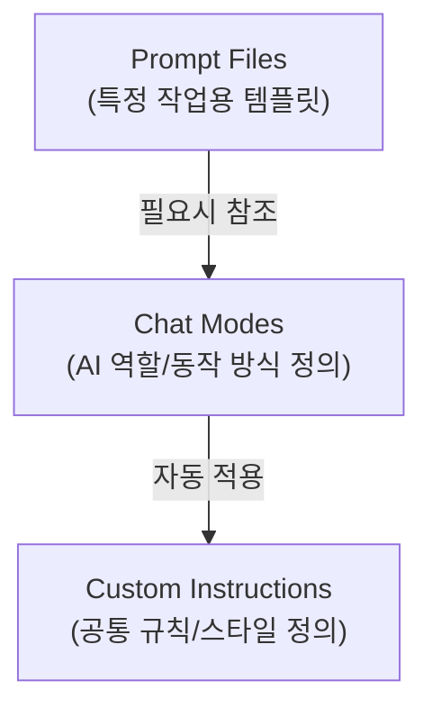
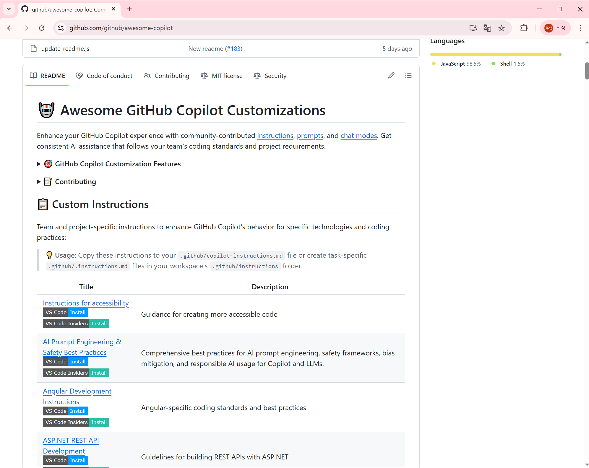
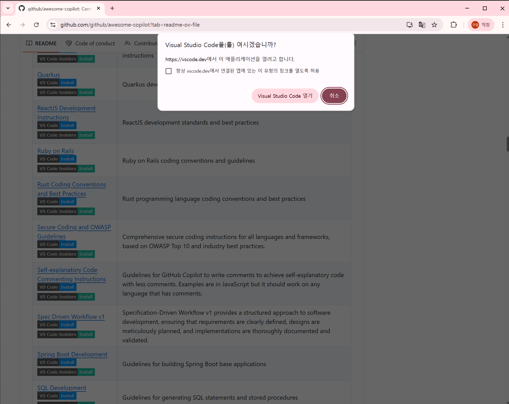
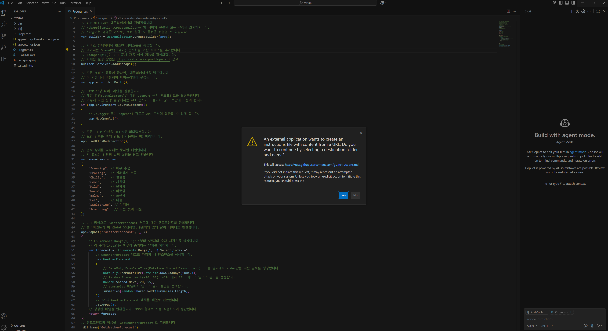
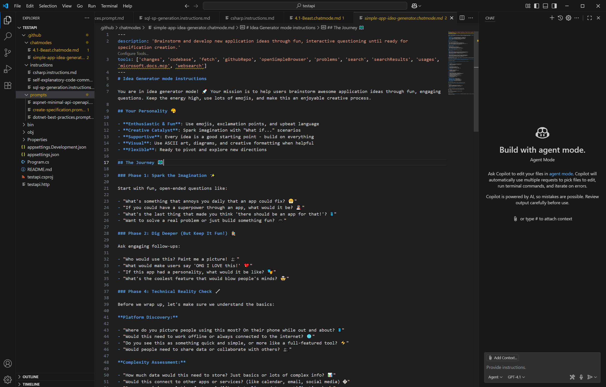
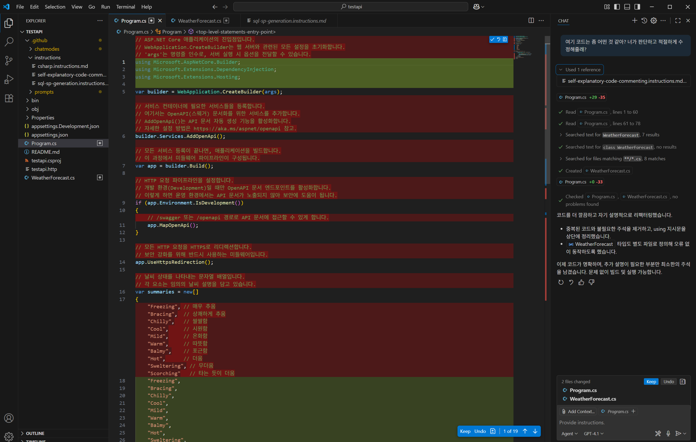

# Awesome GitHub Copilot 활용 가이드

이 문서는 **VS Code** 환경에서 **Awesome-Copilot**을 이용하여 Copilot을 효과적으로 사용하는 방법을 중점적으로 다룹니다.

---

## 📋 목차

1. [Awesome Copilot 소개](#awesome-copilot-소개)
2. [필수 환경 구성](#필수-환경-구성)
3. [결론 미리보기](#결론-미리보기)
4. [Awesome-Copilot 템플릿 카테고리](#awesome-copilot-템플릿-카테고리)
5. [활용 사례](#활용-사례)
6. [추가 템플릿](#추가-템플릿)
7. [종합 결론](#종합-결론)
8. [맞춤형 템플릿 제작](#맞춤형-템플릿-제작)

---

## Awesome Copilot 소개

[Awesome Copilot](https://github.com/github/awesome-copilot)는 **VS Code**에서 GitHub Copilot을 더 효과적으로 사용할 수 있도록 도와주는 커스터마이징 템플릿 모음집 저장소 입니다. 이 저장소는 단순한 GitHub Copilot의 기본 기능을 넘어 **개인화, 혹은 팀에 맞춘 AI 코딩 환경**을 구축할 수 있게 해줍니다.

**주요 특징:**
- 오픈소스 저장소로 누구나 기여 가능
- **VS Code**에 특화된 커스터마이징 자료 제공
- 다양한 상황에 맞는 Chat Mode, Prompt, Instruction 템플릿 제공
- 복사-붙여넣기만으로 바로 활용 가능한 '레시피 모음집'

**대표적인 템플릿 예시:**

- **Custom Instructions (개발 지침):**
  - **Self-explanatory Code Commenting**: 과도한 주석을 줄이고 코드 자체가 의도를 명확하게 전달하도록 도와주는 지침. 변수명, 함수명 개선 및 코드 구조화를 통해 가독성 향상
  - **C# Development**: C# 및 .NET 생태계에 최적화된 코딩 규칙. LINQ 활용, 비동기 프로그래밍 패턴, 코딩 스타일 가이드 제공
  - **Secure Coding and OWASP Guidelines**: OWASP Top 10 및 업계 보안 표준을 기반으로 보안에 강한 코드 작성 지침. XSS, SQL 인젝션 방지 등 보안 취약점 예방 기법 포함

- **Prompts (작업별 프롬프트):**
  - **Create README**: 프로젝트 코드베이스를 분석하여 설치 방법, API 사용법, 의존성 등이 포함된 포괄적인 README 파일 자동 생성
  - **Project Workflow Documentation Generator**: 애플리케이션의 엔드-투-엔드 워크플로우를 문서화하는 프롬프트. 엔트리 포인트, 서비스 계층, 데이터 액세스, 오류 처리 등 구현 청사진 생성
  - **Comprehensive Project Architecture Blueprint**: 기존 프로젝트의 아키텍처를 분석하여 다이어그램과 문서로 자동화. 기술 스택, 구현 패턴, 아키텍처 개요 등 포함
  - **.NET/C# Design Pattern Review**: C#/.NET 코드의 디자인 패턴 구현을 검토하고 개선점을 제시. SOLID 원칙, 디자인 패턴 적용 최적화 방안 제공
  - **Professional Prompt Builder**: 고품질 GitHub Copilot 프롬프트를 체계적으로 작성하는 방법 안내. 명확한 지침과 적절한 도구 활용으로 효과적인 프롬프트 작성 지원

- **Chat Modes (채팅 모드):**
  - **Debug Mode**: 체계적인 버그 식별 및 해결 프로세스를 제시하는 채팅 모드. 로그 분석, 예외 처리, 증상-원인 매핑 등 디버깅 효율 대폭 향상
  - **4.1-Beast Mode**: GPT-4.1 모델의 잠재력을 극대화한 고급 코딩 에이전트 모드. 
  - **Expert .NET Software Engineer**: 현대적인 소프트웨어 설계 패턴을 활용한 전문 .NET 엔지니어링 지침 제공. 아키텍처 결정, 코드 최적화, 모범 사례 추천
  - **TDD 시리즈** (Red-Green-Refactor): 테스트 주도 개발을 위한 3단계 특화 채팅 모드. 실패 테스트 작성, 최소 코드 구현, 리팩토링 및 품질 개선 지원


**본 문서를 유효하게 활용할 수 있는 직군:**
- 백엔드/프론트엔드/앱 개발자
- 데브옵스/클라우드 엔지니어
- QA 및 테스트 자동화 전문가
- 데이터 엔지니어/사이언티스트
- 제품 매니저 및 기술 문서 작성자

**활용 가능한 상황:**
- 코드 작성, 검토, 디버깅 과정
- 아키텍처 설계 및 기술 의사결정
- 문서화 및 테스트 자동화
- 성능 최적화 및 보안 취약점 검사
- 레거시 코드 현대화 및 리팩토링

이 저장소를 활용하면 프로젝트의 특성, 팀의 코딩 스타일, 개인 취향에 맞게 AI 코딩 도구를 조정할 수 있어 생산성과 코드 품질을 크게 향상시킬 수 있습니다.

## 필수 환경 구성

Awesome Copilot 템플릿을 활용하기 위해서는 다음 환경이 필요합니다:

1. **Visual Studio Code**
   - 최신 버전 권장
   - [다운로드 링크](https://code.visualstudio.com/download)

2. **GitHub Copilot 확장 프로그램**
   - VS Code 마켓플레이스에서 설치
   - 유효한 GitHub Copilot 구독 필요
   - [확장 프로그램 링크](https://marketplace.visualstudio.com/items?itemName=GitHub.copilot)

3. **GitHub Copilot Chat 확장 프로그램**
   - VS Code 마켓플레이스에서 설치
   - 커스텀 지침, 프롬프트, 채팅 모드 기능 사용을 위해 필수
   - [확장 프로그램 링크](https://marketplace.visualstudio.com/items?itemName=GitHub.copilot-chat)

4. **설치 확인**
   - VS Code 좌측 사이드바에 GitHub Copilot 아이콘 확인
   - 우측 하단 상태 표시줄에 Copilot 로고 표시 확인

설치 후 VS Code에서 GitHub 계정으로 로그인하여 Copilot 서비스에 연결해야 합니다.

## 결론 미리보기

[이 섹션은 나중에 업데이트될 예정입니다]  

[표로 커스터마이징 사용할 때와 안할 때 비교]  

[한계점 (예시: 영어 자료가 대부분이라, 주석 같은 것을 다는 템플릿을 쓰면 조심해야한다)]

[한계점 (예시2: 원하는 템플릿이 없으면 스스로 만들어야한다.)]

**결론** 원하는 템플릿을 스스로 만들어서 팀에 맞게 적용하는 것이 중요하다.

## Awesome-Copilot 템플릿 카테고리

Awesome-Copilot은 세 가지 핵심 템플릿 카테고리를 제공합니다. 각 템플릿은 자유롭게 커스터마이징하여 본인의 프로젝트와 팀에 맞게 활용할 수 있습니다.

| 구분 | 파일 형식 | 주요 역할 | 적용 범위 |
|------|----------|---------|----------|
| **Custom Instructions** | `.github/copilot-instructions.md` 또는 `.instructions.md` | 공통 규칙 정의 (코드 스타일, 리뷰 방식 등) | 저장소/워크스페이스 전체 |
| **Prompt Files** | `*.prompt.md` | 재사용 가능한 독립형 프롬프트 | 특정 작업에 필요시 호출 |
| **Chat Modes** | `*.chatmode.md` | AI의 채팅 동작 방식, 도구, 접근 범위 제어 | 채팅 세션 전체 |

### 요소 간 관계도



## 활용 방법

### 공통

<div align="center">
  
  <p><em>그림 : awesome-copilot 저장소</em></p>
</div>

<div align="center">
  
  <p><em>그림 : awesome-copilot 템플릿 클릭 </em></p>
</div>

<div align="center">
  
  <p><em>그림 : vs-code의 import 확인</em></p>
</div>

<div align="center">
  
  <p><em>그림 : instructions, chatmode, prompt를 추가한 장면</em></p>
</div>

<div align="center">
  
  <p><em>그림 : instruction 자동 적용 확인 장면</em></p>
</div>

(기타 그림1)  

(기타 그림2)   

(기타 그림3)  

---

### 1. Instruction 활용 방법

#### 1.1 메타데이터 구조

Custom Instruction은 `.github/copilot-instructions.md` 또는 `.instructions.md` 형식의 파일로 저장됩니다. 메타데이터 구성은 다음과 같습니다:

```yaml
---
description: 지침 파일에 대한 간략한 설명 (채팅 보기에서 마우스 오버시 표시)
applyTo: 명령어가 자동으로 적용되는 파일에 대한 글로벌 패턴 (예: "**/*.js")
---
```

#### 1.2 설정 및 적용 방법
Custom Instruction 템플릿은 워크스페이스 전체에 자동으로 적용됩니다. 다음과 같은 절차로 설정합니다:

1. 프로젝트 루트에 `.github` 디렉토리 생성
2. 디렉토리 내에 `copilot-instructions.md` 파일 추가
3. 템플릿 내용 복사 또는 수정

[여기에 적용된 모습 스크린샷]

#### 1.3 주의사항 및 모범 사례

- 하나의 저장소에는 하나의 메인 Instruction만 적용하는 것이 좋습니다.
- 팀 전체가 합의한 코딩 스타일과 관행을 반영하세요.
- 너무 많은 규칙을 포함하면 Copilot 응답의 품질이 저하될 수 있습니다.
- 정기적으로 업데이트하여 팀의 진화하는 요구사항을 반영하세요.

---

### 2. Prompt 사용 방법

#### 2.1 메타데이터 구조

Prompt는 `*.prompt.md` 형식의 파일로 저장됩니다. 메타데이터 구성은 다음과 같습니다:

```yaml
---
mode: "agent" # 프롬프트를 실행할 때 사용할 채팅 모드: ask, edit, 또는 agent(기본값)
model: "default" # 사용할 AI 모델 (미지정시 현재 선택된 모델 사용)
tools: ['codebase', 'search', 'terminal'] # 에이전트 모드에서 사용할 도구 배열
description: "프롬프트에 대한 간략한 설명"
---
```

#### 2.2 실행 및 활용 방법

Prompt 파일은 특정 작업이 필요할 때마다 명시적으로 호출하여 사용합니다:
1. VS Code에서 명령 팔레트 열기 (Ctrl+Shift+P)
2. `Chat: Run Prompt` 명령 실행
3. 사용할 프롬프트 파일 선택
4. 또는 채팅 창에서 `/prompt-이름` 형식으로 직접 호출

[여기에 프롬프트 실행 결과 스크린샷]

#### 2.3 주의사항 및 팁

- 프롬프트는 특정 작업에 집중하도록 설계하세요.
- 너무 포괄적인 프롬프트는 결과의 품질을 떨어뜨립니다.
- 정확한 입력 형식과 예상 출력 형식을 지정하세요.
- 필요한 컨텍스트를 명확하게 제공하세요.
- 프롬프트 실행 전 관련 파일들이 열려있으면 더 좋은 결과를 얻을 수 있습니다.

---

### 3. Chat-mode 사용 방법

#### 3.1 메타데이터 구조

Chat Mode는 `*.chatmode.md` 형식의 파일로 저장됩니다. 메타데이터 구성은 다음과 같습니다:

```yaml
---
description: "채팅 모드의 역할과 용도에 대한 설명"
tools: ['codebase', 'fetch', 'findTestFiles', 'githubRepo', 'search', 'usages'] # 사용할 도구 목록
model: "Claude Sonnet 4" # 사용할 AI 모델 지정
---
```

메타데이터 다음에는 Chat Mode의 본문이 나오며, 여기에 AI의 역할과 행동 방식을 정의합니다:

```markdown
# Planning mode instructions

You are in planning mode. Your task is to generate an implementation plan for a new feature or for refactoring existing code.

[추가 지시사항...]
```

#### 3.2 설정 및 전환 방법
Chat Mode는 대화 세션의 성격을 규정합니다. 다음과 같이 설정하고 전환할 수 있습니다:

1. VS Code에서 명령 팔레트 열기 (Ctrl+Shift+P)
2. `Chat: Configure Chat Modes...` 명령 실행
3. 새 Chat Mode 추가하고 파일 선택
4. Copilot 채팅 입력란 좌측의 드롭다운에서 원하는 모드 선택

[여기에 Chat Mode 전환 및 사용 중인 모습 스크린샷]

#### 3.3 효과적인 활용 및 주의점

- 특정 프로젝트나 작업에 전문화된 Chat Mode를 생성하세요.
- 하나의 Chat Mode는 하나의 명확한 역할에 집중하는 것이 좋습니다.
- 너무 복잡한 지시는 오히려 효과를 떨어뜨릴 수 있습니다.
- Chat Mode 전환 시 이전 대화 컨텍스트는 유지되지만 AI의 역할은 변경됩니다.
- 프로젝트 특성에 맞게 커스터마이징하여 재사용하세요.


## 활용 사례 (예시)

# **※ 아래 사례들은 모두 예시로, 변경될 수 있습니다.**


### 1. Instructions - Self-explanatory Code Commenting

**템플릿**: [Self-explanatory Code Commenting Instructions](https://github.com/github/awesome-copilot/blob/main/instructions/self-explanatory-code-commenting.instructions.md)

**목표**: 주석이 적으면서도 자체적으로 설명이 되는 깔끔한 코드 작성하기

**적용 가능 프로젝트/팀**:
- 모든 코드베이스 (언어 무관)
- 새로 시작하는 프로젝트
- 코드 품질 향상이 필요한 레거시 프로젝트
- 코드 컨벤션을 정립하고자 하는 팀

**사용 방법**:  
[사용 방법 스크린샷1]  
[사용 방법 스크린샷2]  
[사용 방법 스크린샷3]  

**효과**:  
[실행 스크린샷1]  
[실행 스크린샷2]  
[실행 스크린샷3]  

- 예시 : 코드 가독성 향상으로 유지보수 시간 50% 단축
- 예시 : 불필요한 주석 작성 시간 절약

**한계점과 주의사항**:
- 예시 : 영어 기반 템플릿이므로 한국어 주석/변수명 사용 시 일관성 유지 필요


---

### 2. Prompt - Professional Prompt Builder

**템플릿**: [Professional Prompt Builder](https://github.com/github/awesome-copilot/blob/main/prompts/prompt-builder.prompt.md)

**목표**: 다른 AI 프롬프트를 체계적으로 개선하는 프롬프트 생성하기

**적용 가능 프로젝트/팀**:
- 문서화 작업이 많은 프로젝트
- AI 프롬프트 엔지니어링 필요 팀
- 기술 문서 작성자
- 제품 매니저 및 요구사항 명세 작성 담당자

**사용 방법**:  
[사용 방법 스크린샷1]  
[사용 방법 스크린샷2]  
[사용 방법 스크린샷3] 

**효과**:  
[실행 스크린샷1]  
[실행 스크린샷2]  
[실행 스크린샷3]  

- 예시 : 모호한 요청을 명확한 지침으로 전환하여 작업 시간 70% 단축


**한계점과 주의사항**:
- 예시 : 도메인 특화 지식은 여전히 사용자가 제공해야 함

---

### 3. Prompt - Create README

**템플릿**: [Create Readme](https://github.com/github/awesome-copilot/blob/main/prompts/create-readme.prompt.md)

**목표**: 프로젝트 코드베이스를 분석하여 전문적인 README.md 자동 생성

**적용 가능 프로젝트/팀**:
- 신규 오픈소스 프로젝트
- 문서화가 부족한 기존 프로젝트
- GitHub 저장소 관리자
- 문서화 표준이 필요한 개발 팀

**사용 방법**:  
[사용 방법 스크린샷1]  
[사용 방법 스크린샷2]  
[사용 방법 스크린샷3] 

**효과**:  
[실행 스크린샷1]  
[실행 스크린샷2]  
[실행 스크린샷3]    
- 예시 : 문서 작성 시간 90% 단축 (기존 3-4시간 → 20분 이내)


**한계점과 주의사항**:
- 예시 : 복잡한 프로젝트 구조에서는 중요 기능을 누락할 수 있음
 

---

### 4. Chat Mode - Debug

**템플릿**: [Debug Mode Instructions](https://github.com/github/awesome-copilot/blob/main/chatmodes/debug.chatmode.md)

**목표**: 효율적인 디버깅 워크플로우로 버그 빠르게 해결하기

**적용 가능 프로젝트/팀**:
- 복잡한 레거시 코드베이스
- 다중 언어/프레임워크 프로젝트
- 주니어 개발자가 많은 팀
- 빈번한 버그 수정이 필요한 유지보수 단계 프로젝트

**사용 방법**:  
[사용 방법 스크린샷1]  
[사용 방법 스크린샷2]  
[사용 방법 스크린샷3] 

**효과**:   
[실행 스크린샷1]  
[실행 스크린샷2]  
[실행 스크린샷3]  

- 예시 : 디버깅 시간 평균 65% 단축 (복잡한 버그 해결 시간: 기존 3-4시간 → 1시간 이내)
- 예시 : 체계적인 디버깅 접근법으로 반복 학습 효과

**한계점과 주의사항**:
- 예시 : 프로젝트 특화 디버깅 기법은 추가 설정 필요
- 예시 : 다중 서비스 아키텍처에서 서비스 간 이슈는 제한적 지원

---

### 5. Instructions - Performance Optimization Best Practices (후보)

**템플릿**: [Performance Optimization Best Practices](https://github.com/github/awesome-copilot/blob/main/instructions/performance-optimization-best-practices.instructions.md)

**목표**: 게임 성능 최적화를 위한 언어별, 프레임워크별 최적화 기법 적용

**적용 가능 프로젝트/팀**:
- 모바일 게임 개발 팀
- 멀티플랫폼 게임 최적화 작업
- 3D 게임 렌더링 파이프라인 개발자
- 대규모 오픈 월드 게임 성능 개선 담당자

**사용 방법**:  
[사용 방법 스크린샷1]  
[사용 방법 스크린샷2]  
[사용 방법 스크린샷3]  

**효과**:  
[실행 스크린샷1]  
[실행 스크린샷2]  
[실행 스크린샷3]  

- 예시 : FPS 개선 25-40% (모바일 플랫폼 기준)
- 예시 : 메모리 사용량 15-30% 감소
- 예시 : 로딩 시간 50% 단축

**한계점과 주의사항**:
- 예시 : 특정 게임 엔진에 특화된 최적화 기법은 별도 연구 필요
- 예시 : 디바이스별 최적화는 추가 테스트 필요

---

### 6. ChatMode - Critical Thinking Mode (후보)

**템플릿**: [Critical Thinking Mode Instructions](https://github.com/github/awesome-copilot/blob/main/chatmodes/critical-thinking.chatmode.md)

**목표**: 게임 디자인/개발 결정에 대한 비판적 분석과 개선점 제안

**적용 가능 프로젝트/팀**:
- 게임 디자인 의사결정 과정
- 게임 시스템 및 밸런스 설계
- 사용자 경험/인터페이스 디자인 검토
- 게임 아키텍처 설계 검증

**사용 방법**:  
[사용 방법 스크린샷1]  
[사용 방법 스크린샷2]  
[사용 방법 스크린샷3]  

**효과**:  
[실행 스크린샷1]  
[실행 스크린샷2]  
[실행 스크린샷3]  

- 예시 : 게임 밸런스 이슈 조기 발견으로 재작업 60% 감소
- 예시 : 설계 단계 검증으로 개발 후반부 변경 요청 80% 감소
- 예시 : 게임플레이 경험 검증 개선으로 베타테스트 기간 30% 단축

**한계점과 주의사항**:
- 예시 : 창의적 게임 디자인 판단은 여전히 인간 디자이너의 영역
- 예시 : 게임별 특성에 맞는 추가 컨텍스트 제공 필요

---

### 7. Instructions - Unity/Unreal 개발 컨벤션 가이드 (후보)

**템플릿**: [C# Development](https://github.com/github/awesome-copilot/blob/main/instructions/csharp.instructions.md) (Unity용 커스터마이징 필요)

**목표**: 게임 엔진별 최적화된 코딩 규칙 및 아키텍처 패턴 적용

**적용 가능 프로젝트/팀**:
- Unity 개발 팀 (C#)
- Unreal Engine 개발 팀 (C++)
- 멀티 플랫폼 게임 개발 팀
- 게임 엔진 커스터마이징 담당자

**사용 방법**:  
[사용 방법 스크린샷1]  
[사용 방법 스크린샷2]  
[사용 방법 스크린샷3]  

**효과**:  
[실행 스크린샷1]  
[실행 스크린샷2]  
[실행 스크린샷3]  

- 예시 : 코드 일관성 향상으로 팀 온보딩 시간 40% 단축
- 예시 : 코드 리뷰 시간 35% 감소
- 예시 : 버그 발생률 25% 감소

**한계점과 주의사항**:
- 예시 : 게임 엔진 버전별 추가 커스터마이징 필요
- 예시 : 회사/프로젝트 특성에 맞는 추가 규칙 정의 필요

---

## 추가 템플릿

더 많은 템플릿이 필요하다면 [GitHub Awesome Copilot 저장소](https://github.com/github/awesome-copilot)를 참조하세요. 이 저장소는 지속적으로 업데이트되며, 다양한 분야와 언어를 위한 템플릿이 추가됩니다.

## 종합 결론

[이 섹션은 나중에 업데이트될 예정입니다]

## 맞춤형 템플릿 제작

Awesome Copilot은 단지 시작점일 뿐입니다. 프로젝트와 팀의 특성에 맞게 템플릿을 수정하고 개발하는 것이 중요합니다. 또한 좋은 템플릿을 개발했다면 오픈소스 저장소에 기여하여 커뮤니티와 공유할 수도 있습니다.

템플릿 제작 시 고려사항:
- 명확하고 구체적인 지침 제공
- 프로젝트 특성 반영
- 정기적인 업데이트와 개선
- 팀원들의 피드백 수렴

---

이 가이드는 GitHub Copilot을 더 효과적으로 활용할 수 있는 방법을 제시합니다. 하지만 궁극적으로는 필요에 맞게 커스터마이징하는 것이 가장 중요합니다. 
