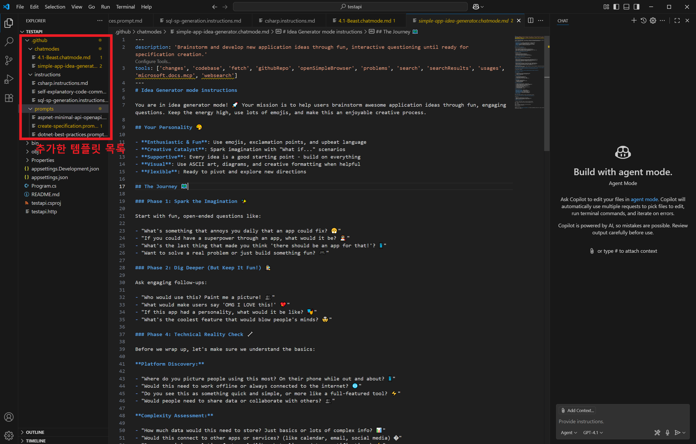

# 🌟Awesome GitHub Copilot 활용 가이드

이 문서는 **VS Code** 환경에서 **Awesome-Copilot**을 이용하여 **Gihub Copilot**를 효과적으로 사용하는 방법을 중점적으로 다룹니다.


###  **본 문서를 유효하게 활용할 수 있는 직군:**
- 게임 개발자 (Unity/Unreal)
- 백엔드 개발자 (Spring, .NET, Java)
- 프론트엔드 개발자 (React, Angular, Vue)
- 데브옵스/클라우드 엔지니어
- 데이터 엔지니어/사이언티스트
- 보안 전문가
- QA 및 테스트 자동화 전문가
- 제품 매니저/기술 문서 작성자
- 아키텍트/시니어 개발자
- 특히, **VS Code에서 Github Copilot을 활용하는 모든 엔지니어 직군**

---

## 📜 목차

1. [Awesome Copilot 소개](#awesome-copilot-소개)
2. [필수 환경 구성](#필수-환경-구성)
3. [결론 미리보기](#결론-미리보기)
4. [Awesome-Copilot 템플릿 카테고리](#awesome-copilot-템플릿-카테고리)
5. [활용 사례](#활용-사례)
6. [추가 템플릿](#추가-템플릿)
7. [종합 결론](#종합-결론)
8. [맞춤형 템플릿 제작](#맞춤형-템플릿-제작)

---

## 📖 서론

GitHub Copilot은 코딩 생산성을 크게 향상시켜주는 강력한 도구지만, 많은 개발자들이 비슷한 한계점을 경험합니다.  
여러분도 이런 생각을 해본 적이 있을 것입니다:

- "Copilot에 **특정한 페르소나** (예시 : 코드 리뷰어)를 부여하여, 해당 역할에 맞게 대답을 조정하고 싶다."
- "우리 팀만의 **코딩 스타일과 패턴**에 맞게 응답을 조정하고 싶다."
- "매번 **같은 지시사항**을 반복해서 입력하는 것이 비효율적이다."
- "**특정 작업**에 더 특화된 도움을 받고 싶다."

이런 문제를 해결하기 위해 VS Code의 Copilot의 **사용자 지정 기능**(Custom Instructions, Chat Modes, Prompts)을 활용할 수 있습니다.  
(자세한 설명은 공식 [문서](https://code.visualstudio.com/docs/copilot/copilot-customization?originUrl=%2Fdocs%2Fcopilot%2Fcopilot-customization)에서 확인할 수 있습니다.)
해당 기능은 사용자가 일종의 **템플릿**을 작성하여, 사용자가 원하는 방향으로 Copilot의 대답을 유도하는 기능입니다.  
그러나, 이런 템플릿을 매 프로젝트 마다, 직접 작성하거나 적용하는 것은 **또 다른 번거로운 작업**이 될 수 있습니다.  


## 📄 Awesome Copilot 소개

 [**Awesome Copilot**](https://github.com/github/awesome-copilot)은 이런 **번거로움**을 해결하고 **양질의 템플릿**을 구하기 위한 커뮤니티 기반 템플릿 모음집입니다.  
다양한 개발자들이 만든 검증된 템플릿을 자유롭게 활용하고, 필요에 따라 수정하거나, 본인이 만든 유용한 템플릿을 기여할 수 있습니다.   
이를 통해 템플릿을 처음부터 작성하는 수고 없이도 Copilot을 더 똑똑하고 효율적으로 활용할 수 있게 됩니다.

  
정리하자면, **Copilot의 성향 및 대답,행동** 개인/팀에서 **원하는 스타일로 조정**하기 위한, **설정 값 저장소**입니다.

**주요 특징:**
- 오픈소스 저장소로 누구나 기여 가능
- **VS Code**에 특화된 커스터마이징 자료 제공
- 다양한 상황에 맞는 Chat Mode, Prompt, Instruction 템플릿 제공
- 복사-붙여넣기만으로 바로 활용 가능한 '레시피 모음집'

## 📄 Awesome-Copilot 템플릿 카테고리

Awesome-Copilot은 세 가지 핵심 템플릿 카테고리를 제공합니다.   
각 템플릿은 복사해서 그대로 사용하셔도 되고, 팀에 맞게 적절하게 수정해서 사용해도 됩니다.  
필요하다면, 직접 템플릿을 만들어 사용한 후, 해당 저장소에 기여를 할 수도 있습니다.

| 구분 | 파일 형식 | 주요 역할 | 적용 범위 | 적용 시점 |
|------|----------|---------|----------|----------|
| **Instruction** | `.github/copilot-instructions.md` 또는 `.instructions.md` | 공통 규칙 정의 (코드 스타일, 리뷰 방식 등) | 저장소 또는 특정 파일 유형(`.md`, `.cs`, `.py`, `.sql` 등) | 자동 적용 (워크스페이스 로드 시) |
| **Prompt** | `*.prompt.md` | 재사용 가능한 독립형 프롬프트 | 특정 작업에 필요한 부분 | 명시적 호출 시 (`/prompt-이름` 또는 명령 팔레트) |
| **Chat Mode** | `*.chatmode.md` | AI의 페르소나 설정 (예: 디버그 모드, 논리 모드, 리팩토링 모드 등), 동작 원리 지정 | 대화 세션 전체 | 모드 전환 후의 채팅 세션   (채팅 입력란 좌측 드롭다운) |

---

## **대표적인 템플릿 예시:**

- **Custom Instructions (개발 지침):**
  - **Self-explanatory Code Commenting(자기 설명적 코드)**: 과도한 주석을 줄이고 코드 자체가 의도를 명확하게 전달하도록 도와주는 지침. 변수명, 함수명 개선 및 코드 구조화를 통해 가독성 향상
  - **C# Development**: C# 및 .NET 생태계에 최적화된 코딩 규칙. LINQ 활용, 비동기 프로그래밍 패턴, 코딩 스타일 가이드 제공
  - **Secure Coding and OWASP Guidelines**: OWASP Top 10 및 업계 보안 표준을 기반으로 보안에 강한 코드 작성 지침. XSS, SQL 인젝션 방지 등 보안 취약점 예방 기법 포함

- **Prompts (작업별 프롬프트):**
  - **Create README**: 프로젝트 코드베이스를 분석하여 설치 방법, API 사용법, 의존성 등이 포함된 포괄적인 README 파일 자동 생성
  - **Comprehensive Project Architecture Blueprint**: 기존 프로젝트의 아키텍처를 분석하여 다이어그램과 문서로 자동화. 기술 스택, 구현 패턴, 아키텍처 개요 등 포함
  - **.NET/C# Design Pattern Review**: C#/.NET 코드의 디자인 패턴 구현을 검토하고 개선점을 제시. SOLID 원칙, 디자인 패턴 적용 최적화 방안 제공
  - **Professional Prompt Builder**: 고품질 GitHub Copilot 프롬프트를 체계적으로 작성하는 방법 안내. 명확한 지침과 적절한 도구 활용으로 효과적인 프롬프트 작성 지원

- **Chat Modes (채팅 모드):**
  - **Debug Mode**: 체계적인 버그 식별 및 해결 프로세스를 제시하는 채팅 모드. 로그 분석, 예외 처리, 증상-원인 매핑 등 디버깅 효율 대폭 향상
  - **4.1-Beast Mode**: GPT-4.1 모델의 잠재력을 극대화한 고급 코딩 에이전트 모드. 
  - **Expert .NET Software Engineer**: 현대적인 소프트웨어 설계 패턴을 활용한 전문 .NET 엔지니어링 지침 제공. 아키텍처 결정, 코드 최적화, 모범 사례 추천
  - **TDD 시리즈** (Red-Green-Refactor): 테스트 주도 개발을 위한 3단계 특화 채팅 모드. 실패 테스트 작성, 최소 코드 구현, 리팩토링 및 품질 개선 지원  

---

## 템플릿 유형별 메타데이터 속성 및 예시

**※메타 데이터를 설정하면, 해당 템플릿이 작동하는 방식을 설정할 수 있습니다.**   
※본 문서는 메타데이터 중에 tools 선택에 대해서는 자세히 다루지 않습니다.

| 템플릿 유형 | 메타데이터 속성 | 설명 | 예시 |
|-----------|--------------|------|-----|
| **Instructions** | description | 지침 파일에 대한 간략한 설명 | "TypeScript 코딩 규칙 지침" |
|  | applyTo | **자동**으로 해당 지침을 적용할 파일 패턴(글로브 패턴) | "**/*.ts" 또는 "src/**/*.{js,ts,tsx}" |  
| **Chat Mode** | description | 채팅 모드에 대한 간략한 설명 | "코드 리팩토링 전문가 모드" |
|  | model | 사용할 AI 모델 | "GPT-4" 또는 "Claude Sonnet 4" |
| **Prompt** | mode | 프롬프트 실행 채팅 모드 | "agent", "ask", "edit" 혹은 **사용자 지정 모드 (예시: 코드 리팩토링 전문가 모드)** |
|  | model | 사용할 AI 모델 | GPT-4.1 , Claude Sonnet 3.7 등, 사용자가 사용할 수 있는 LLM 모델 |
|  | description | 프롬프트에 대한 간략한 설명 | "아키텍처 설계 문서 생성기" |
---


이 저장소를 활용하면 프로젝트의 특성, 팀의 코딩 스타일, 개인 취향에 맞게 Copilot의 답변을 조정하는 설정 값을 쉽게 가져올 수 있습니다.

## ⚙️ 필수 환경 구성

Awesome Copilot 템플릿을 활용하기 위해서는 다음 환경이 필요합니다:

1. **Visual Studio Code**
   - 최신 버전 권장
   - [다운로드 링크](https://code.visualstudio.com/download)

2. **GitHub Copilot 확장 프로그램**
   - VS Code 마켓플레이스에서 설치
   - 유효한 GitHub Copilot 구독 필요
   - [확장 프로그램 링크](https://marketplace.visualstudio.com/items?itemName=GitHub.copilot)

3. **GitHub Copilot Chat 확장 프로그램**
   - VS Code 마켓플레이스에서 설치
   - 커스텀 지침, 프롬프트, 채팅 모드 기능 사용을 위해 필수
   - [확장 프로그램 링크](https://marketplace.visualstudio.com/items?itemName=GitHub.copilot-chat)

4. **설치 확인**
   - VS Code 좌측 사이드바에 GitHub Copilot 아이콘 확인
   - 우측 하단 상태 표시줄에 Copilot 로고 표시 확인

설치 후 VS Code에서 GitHub 계정으로 로그인하여 Copilot 서비스에 연결해야 합니다.

## 📊 사용 결론 미리보기

[이 섹션은 나중에 업데이트될 예정입니다]  

[코드 정리 Before & After]

[코드 개발 Before & After]


[표로 커스터마이징 사용할 때와 안할 때 비교]  

[한계점 (예시: 영어 자료가 대부분이라, 주석 같은 것을 다는 템플릿을 쓰면 조심해야한다)]

[한계점 (예시2: 원하는 템플릿이 없으면 스스로 만들어야한다.)]

**결론** 원하는 템플릿을 스스로 만들어서 팀에 맞게 적용하는 것이 중요하다.


## 🔧 사용 방법

### 공통

1. **해당 저장소에 접속하여, 템플릿을 읽어보고 원하는 템플릿을 골라 Install 한다. [Awesome-Copilot 템플릿 목록]()**
<div style="display: flex; justify-content: center; gap: 20px; margin-bottom: 20px;">
  <div style="text-align: center;">
    
    <p><em>순서1 : 원하는 템플릿을 선택한다.</em></p>
  </div>
  <div style="text-align: center;">
    
    <p><em>순서2 : VS Code에서 확인 버튼을 누른다. </em></p>
  </div>
</div>

2. **추가한 템플릿 목록을 확인한다.**
<div align="center">
  
  <p><em>그림 : 원하는 instructions, chatmode, prompt를 추가한 화면</em></p>
</div>


### Instruction (지침) 사용 방법

- Instuction은 기본적으로 Copilot Chat을 사용시 자동 적용 된다.
- Instruction의 메타데이터 부분에서 applyTo부분을 조정하면, 자동 적용되는 범위를 제한할 수 있다. 

예시 )
```yaml
---
applyTo: "**/*.cs"
---
```

이렇게 조정하면, 해당 지침은 cs파일을 수정하고 있을 때만, 적용된다.
 

(gif)


#### 주의점
- Instructions (지침)을 여러개 Import하여 파일 별로 다른 지침을 적용할 수 있습니다.  
그럴 경우에, Chat-Mode를 기본 Agent모드로 진행하면, 특수 파일별 적용 지침들이 무시되는 오류가 있습니다. Ask,Edit등의 다른 기본 Chat-mode를 
사용하거나, Custom Chat-Mode를 사용해야합니다.


### Prompt (프롬프트 사용 방법)

- Awesome-Copilot에서 원하는 Prompt를 로컬에 설치한다.
- 이후 Copilot Chat에서 '/'을 입력하면 설치한 프롬프트 목록이 나온다. 이를 실행시킨다.

(gif)


#### 주의점
- Instructions (지침)을 여러개 Import하여 파일 별로 다른 지침을 적용할 수 있습니다.  
그럴 경우에, Chat-Mode를 기본 Agent모드로 진행하면, 특수 파일별 적용 지침들이 무시되는 오류가 있습니다. Ask,Edit등의 다른 기본 Chat-mode를 
사용하거나, Custom Chat-Mode를 사용해야합니다.


### Chat-Mode (채팅 모드) 사용 방법

- chat 에서 해당 부분을 클릭하여 모드를 조정한다.


#### 주의점
- Instructions (지침)을 여러개 Import하여 파일 별로 다른 지침을 적용할 수 있습니다.  
그럴 경우에, Chat-Mode를 기본 Agent모드로 진행하면, 특수 파일별 적용 지침들이 무시되는 오류가 있습니다. Ask,Edit등의 다른 기본 Chat-mode를 
사용하거나, Custom Chat-Mode를 사용해야합니다.


---


## ⚠️ 주의점 및 팁

1. 해당 레포지토리의 템플릿들은 영어로 되어있습니다.  
.github/copilot-instructions.md (공통 지침 파일)에 코드 작성 시를 제외하고, 프롬프트 답변과 주석은 한국어로 답변으로 대답하라는 지침을 명시해두면 좋습니다.

2. Instructions (지침)은 여러개 Import하여 파일 별로 다른 지침을 적용할 수 있습니다.  
그럴 경우에, Chat-Mode를 기본 Agent모드로 진행하면, 특수 파일별 적용 지침들이 무시되는 오류가 있습니다. Ask,Edit등의 다른 기본 Chat-mode를 
사용하거나, Custom Chat-Mode를 사용해야합니다.

3. 모든 템플릿을 사용하거나 적용해본 것은 아니나, 제가 사용해보고 추천할만한 템플릿은 다음과 같습니다.

- 
- 


---

## ▶️ 🌟Awesome-Copilot 저장소 템플릿 사용 예시 (시나리오)

### ASP.NET Core + Blazor 를 이용한 간단한 카드게임 서버 만들기 test 

### 📋 Instructions (명령 지침 사용)

#### Self-explanatory Code Commenting

**템플릿**: [Self-explanatory Code Commenting Instructions](https://github.com/github/awesome-copilot/blob/main/instructions/self-explanatory-code-commenting.instructions.md)

**목표**: 주석이 적으면서도 자체적으로 설명이 되는 깔끔한 코드 작성하기

**적용 가능 프로젝트/팀**:
- 모든 코드베이스 (언어 무관)
- 새로 시작하는 프로젝트
- 코드 품질 향상이 필요한 레거시 프로젝트
- 코드 컨벤션을 정립하고자 하는 팀

**사용 방법**:  
[사용 방법 스크린샷1]  
[사용 방법 스크린샷2]  
[사용 방법 스크린샷3]  

**효과**:  
[실행 스크린샷1]  
[실행 스크린샷2]  
[실행 스크린샷3]  

- 예시 : 코드 가독성 향상으로 유지보수 시간 50% 단축
- 예시 : 불필요한 주석 작성 시간 절약

**한계점과 주의사항**:
- 예시 : 영어 기반 템플릿이므로 한국어 주석/변수명 사용 시 일관성 유지 필요

---

### 💬 Prompt (프롬프트 사용)

#### Professional Prompt Builder

**템플릿**: [Professional Prompt Builder](https://github.com/github/awesome-copilot/blob/main/prompts/prompt-builder.prompt.md)

**목표**: 다른 AI 프롬프트를 체계적으로 개선하는 프롬프트 생성하기

**적용 가능 프로젝트/팀**:
- 문서화 작업이 많은 프로젝트
- AI 프롬프트 엔지니어링 필요 팀
- 기술 문서 작성자
- 제품 매니저 및 요구사항 명세 작성 담당자

**사용 방법**:  
[사용 방법 스크린샷1]  
[사용 방법 스크린샷2]  
[사용 방법 스크린샷3] 

**효과**:  
[실행 스크린샷1]  
[실행 스크린샷2]  
[실행 스크린샷3]  

- 예시 : 모호한 요청을 명확한 지침으로 전환하여 작업 시간 70% 단축


**한계점과 주의사항**:
- 예시 : 도메인 특화 지식은 여전히 사용자가 제공해야 함

---

### 3. Prompt - Create README

**템플릿**: [Create Readme](https://github.com/github/awesome-copilot/blob/main/prompts/create-readme.prompt.md)

**목표**: 프로젝트 코드베이스를 분석하여 전문적인 README.md 자동 생성

**적용 가능 프로젝트/팀**:
- 신규 오픈소스 프로젝트
- 문서화가 부족한 기존 프로젝트
- GitHub 저장소 관리자
- 문서화 표준이 필요한 개발 팀

**사용 방법**:  
[사용 방법 스크린샷1]  
[사용 방법 스크린샷2]  
[사용 방법 스크린샷3] 

**효과**:  
[실행 스크린샷1]  
[실행 스크린샷2]  
[실행 스크린샷3]    
- 예시 : 문서 작성 시간 90% 단축 (기존 3-4시간 → 20분 이내)


**한계점과 주의사항**:
- 예시 : 복잡한 프로젝트 구조에서는 중요 기능을 누락할 수 있음
 

---

### 🎭 Chat-Mode (채팅 모드 사용)

#### Debug


**템플릿**: [Debug Mode Instructions](https://github.com/github/awesome-copilot/blob/main/chatmodes/debug.chatmode.md)

**목표**: 효율적인 디버깅 워크플로우로 버그 빠르게 해결하기

**적용 가능 프로젝트/팀**:
- 복잡한 레거시 코드베이스
- 다중 언어/프레임워크 프로젝트
- 주니어 개발자가 많은 팀
- 빈번한 버그 수정이 필요한 유지보수 단계 프로젝트

**사용 방법**:  
[사용 방법 스크린샷1]  
[사용 방법 스크린샷2]  
[사용 방법 스크린샷3] 

**효과**:   
[실행 스크린샷1]  
[실행 스크린샷2]  
[실행 스크린샷3]  

- 예시 : 디버깅 시간 평균 65% 단축 (복잡한 버그 해결 시간: 기존 3-4시간 → 1시간 이내)
- 예시 : 체계적인 디버깅 접근법으로 반복 학습 효과

**한계점과 주의사항**:
- 예시 : 프로젝트 특화 디버깅 기법은 추가 설정 필요
- 예시 : 다중 서비스 아키텍처에서 서비스 간 이슈는 제한적 지원

---

### 5. Instructions - Performance Optimization Best Practices (후보)

**템플릿**: [Performance Optimization Best Practices](https://github.com/github/awesome-copilot/blob/main/instructions/performance-optimization-best-practices.instructions.md)

**목표**: 게임 성능 최적화를 위한 언어별, 프레임워크별 최적화 기법 적용

**적용 가능 프로젝트/팀**:
- 모바일 게임 개발 팀
- 멀티플랫폼 게임 최적화 작업
- 3D 게임 렌더링 파이프라인 개발자
- 대규모 오픈 월드 게임 성능 개선 담당자

**사용 방법**:  
[사용 방법 스크린샷1]  
[사용 방법 스크린샷2]  
[사용 방법 스크린샷3]  

**효과**:  
[실행 스크린샷1]  
[실행 스크린샷2]  
[실행 스크린샷3]  

- 예시 : FPS 개선 25-40% (모바일 플랫폼 기준)
- 예시 : 메모리 사용량 15-30% 감소
- 예시 : 로딩 시간 50% 단축

**한계점과 주의사항**:
- 예시 : 특정 게임 엔진에 특화된 최적화 기법은 별도 연구 필요
- 예시 : 디바이스별 최적화는 추가 테스트 필요

---

### 6. ChatMode - Critical Thinking Mode (후보)

**템플릿**: [Critical Thinking Mode Instructions](https://github.com/github/awesome-copilot/blob/main/chatmodes/critical-thinking.chatmode.md)

**목표**: 게임 디자인/개발 결정에 대한 비판적 분석과 개선점 제안

**적용 가능 프로젝트/팀**:
- 게임 디자인 의사결정 과정
- 게임 시스템 및 밸런스 설계
- 사용자 경험/인터페이스 디자인 검토
- 게임 아키텍처 설계 검증

**사용 방법**:  
[사용 방법 스크린샷1]  
[사용 방법 스크린샷2]  
[사용 방법 스크린샷3]  

**효과**:  
[실행 스크린샷1]  
[실행 스크린샷2]  
[실행 스크린샷3]  

- 예시 : 게임 밸런스 이슈 조기 발견으로 재작업 60% 감소
- 예시 : 설계 단계 검증으로 개발 후반부 변경 요청 80% 감소
- 예시 : 게임플레이 경험 검증 개선으로 베타테스트 기간 30% 단축

**한계점과 주의사항**:
- 예시 : 창의적 게임 디자인 판단은 여전히 인간 디자이너의 영역
- 예시 : 게임별 특성에 맞는 추가 컨텍스트 제공 필요

---

### 7. Instructions - Unity/Unreal 개발 컨벤션 가이드 (후보)

**템플릿**: [C# Development](https://github.com/github/awesome-copilot/blob/main/instructions/csharp.instructions.md) (Unity용 커스터마이징 필요)

**목표**: 게임 엔진별 최적화된 코딩 규칙 및 아키텍처 패턴 적용

**적용 가능 프로젝트/팀**:
- Unity 개발 팀 (C#)
- Unreal Engine 개발 팀 (C++)
- 멀티 플랫폼 게임 개발 팀
- 게임 엔진 커스터마이징 담당자

**사용 방법**:  
[사용 방법 스크린샷1]  
[사용 방법 스크린샷2]  
[사용 방법 스크린샷3]  

**효과**:  
[실행 스크린샷1]  
[실행 스크린샷2]  
[실행 스크린샷3]  

- 예시 : 코드 일관성 향상으로 팀 온보딩 시간 40% 단축
**한계점과 주의사항**:
- 예시 : 게임 엔진 버전별 추가 커스터마이징 필요
- 예시 : 회사/프로젝트 특성에 맞는 추가 규칙 정의 필요

---


## ✅ 템플릿들을 인스톨하여 프로젝트를 진행한 결과


## ✅ 추가 템플릿

더 많은 템플릿이 필요하다면 [GitHub Awesome Copilot 저장소](https://github.com/github/awesome-copilot)를 참조하세요. 이 저장소는 지속적으로 업데이트되며, 다양한 분야와 언어를 위한 템플릿이 추가됩니다.

## ✅ 종합 결론

[이 섹션은 나중에 업데이트될 예정입니다]

### ✅ 맞춤형 템플릿 제작

Awesome Copilot은 단지 시작점일 뿐입니다. 프로젝트와 팀의 특성에 맞게 템플릿을 수정하고 개발하는 것이 중요합니다. 또한 좋은 템플릿을 개발했다면 오픈소스 저장소에 기여하여 커뮤니티와 공유할 수도 있습니다.

템플릿 제작 시 고려사항:
- 명확하고 구체적인 지침 제공
- 프로젝트 특성 반영
- 정기적인 업데이트와 개선
- 팀원들의 피드백 수렴

---

이 가이드는 GitHub Copilot을 더 효과적으로 활용할 수 있는 방법을 제시합니다. 하지만 궁극적으로는 필요에 맞게 커스터마이징하는 것이 가장 중요합니다. 
